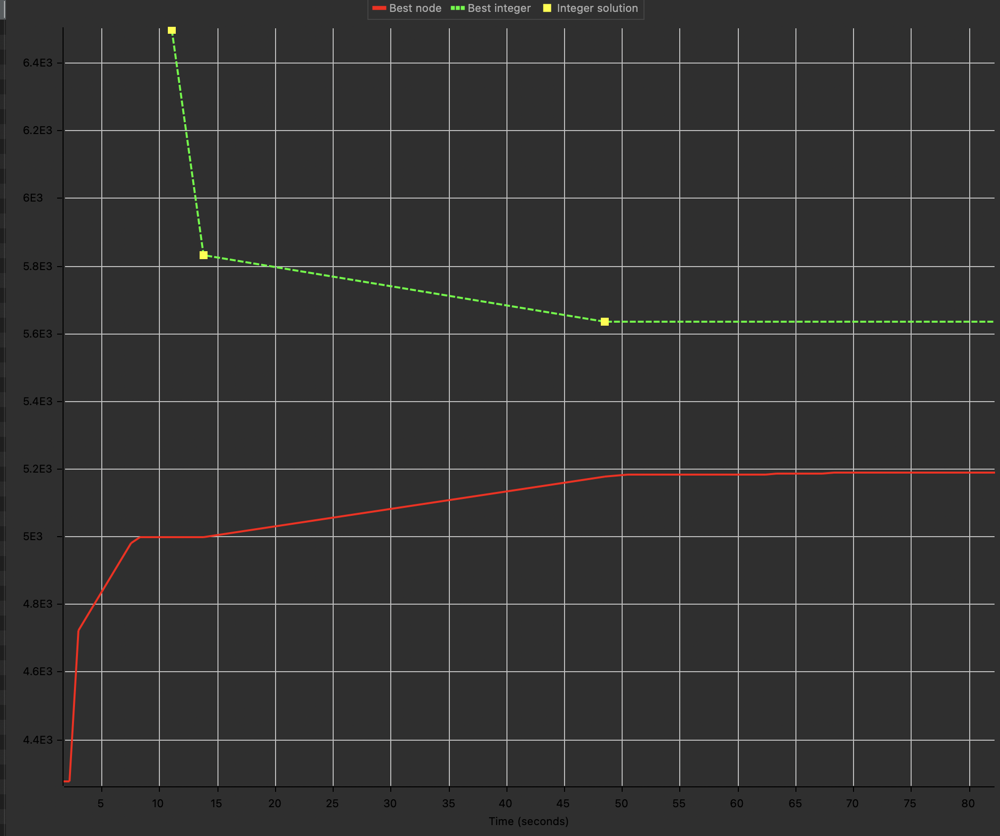

# Primera entrega del trabajo practico

 - Materia: Modelos y Optimizacion I 
 - Fecha de entrega: 02/05/2022
 - Alumno: Federico Cavazzoli
 - Padron: 98533


# Objetivo
Deterninar el orden en el que el camion debe recorrer los puntos de la ruta cumpliendo con las restricciones de capacidad minimizando la distancia total.

# Hipotesis y Supuestos
 - El camion debe recorrer todos los puntos de la ruta.
 - La carga de todos los puntos es menor o igual a la capacidad del camion.
 - La distancia entre puntos es constante (no se mudan los bancos en ningun momento).
 - No se considera el costo de transporte entre puntos.
 - La distancia de a casa central al cualquier punto es constante.
 - Cualquier punto de la ruta es valido para iniciar el recorrido siempre y cuando cumpla las condiciones de capacidad.
 - El camion solo carga y descarga en los puntos de la ruta (no hay robos y perdidas).
 - El camion no puede cargar y descargar en el mismo punto.


# Algoritmos
## Greedy

La idea de este algoritmo es tomar el punto de inicio y a partir de ahi comenzar a recorrer. 
Siempre se elige como proximo punto aquel mas cercano que cumpla con las condiciones de capacidad y que ademas no haya sido visitado.
Es por definicion, un algoritmo greedy, dado que sin importar el caso en el que se encuentre se aplica el mismo algoritmo para resolver el siguente punto a visitar.

```python
def can_go_to_city(city_weights, city, amount):
    return (amount + city_weights[city] > 0) and (amount + city_weights[city] < 30)


def solve(matrix, city_weights, initial_city):
    solution = [initial_city]
    city = initial_city
    min_city = 0
    current_amount = city_weights[initial_city]
    total_distance = 0
    while len(solution) < len(matrix):
        min_distance = float("inf")
        for i in range(len(matrix)):
            if (i not in solution) and can_go_to_city(city_weights, i, current_amount):
                if matrix[city][i] < min_distance:
                    min_distance = matrix[city][i]
                    min_city = i
        solution.append(min_city)
        city = min_city
        current_amount += city_weights[min_city]
        total_distance += min_distance
    # Primer item es 0 y deberia ser 1, ultimo item es 149 y deberia ser 150.
    return (total_distance, [str(x + 1) for x in solution])
```
## Fuerza Bruta - Greedy

Este algoritmo es una mejora del algoritmo anterior, donde se elige una solucion inicial, se guarda el resultado y luego se elige otro punto de inicio y se vuelve a correr el algoritmo, si la solucion es mejor que la guardada se guarda y se repite el proceso hasta que no queden puntos iniciales por probar.
Cabe aclarar que dadas las condiciones de capacidad el camion parte vacio y es por eso que la primera parada debe ser si o si un punto con carga positiva, entonces todos los negativos son filtrados en un primer paso para evitar ejecuciones inecesarias.

```python
import algorithms.traveling_salesman_solver as tsm

def solve(matrix, city_weights):
    positive_city_weights_index = [
        i for i, x in enumerate(city_weights) if x > 0]
    best_sol = (float("inf"), [])
    for i in positive_city_weights_index:
        sol = tsm.solve(matrix, city_weights, i)
        if sol[0] < best_sol[0]:
            best_sol = sol
    return best_sol[1]
```

# Resolucion por programacion lineal

## Definicion de variables
 - $Y_{ij}$: recorre el trayecto entre los puntos i y j
 - $U_i$: orden en el que llega al punto i
 - $Z_{ij}$: visita a i antes que a j
 - $C\_ACUM_j$: cantidad de carga acumulada en el punto j

## Definicion de constantes
 - $d_{ij}$: distancia entre los puntos i y j
 - $C_i$: monto de dinero a cargar en el punto i 
 - $CARGA\_MAXIMA$: capacidad maxima del camion
 - $CARGA\_MINIMA$: capacidad minima del camion (por enunciado es 0 pero la defino como constante para poder modificarla de ser necesario)
## Modelo Matematico

Definicion de ecuaciones del problema del viajante:

$$ \sum_{i=0}^{150} Y_{ij} = 1, i \neq j $$
$$ \sum_{j=0}^{150} Y_{ij} = 1, j \neq i $$

Elimino los Subtours:

$$ U_{i} - U_{j} + 150 Y_{ij} \leq 149, \forall [i,j] \in [1...150], i \neq j$$

Defino una variable para saber si visito a un punto antes que otro:

$$ U_j \leq U_i + M Z_{ij} , \forall [i,j] \in [1...150] $$ 

$$ U_i \leq U_j + M (1 - Z_{ji}) , \forall [i,j] \in [1...150] $$

Uso la variable para definir la cantidad de carga acumulada en cada punto:

$$ C\_ACUM_j = \sum_{i=0}^{150} C_{i} Z_{ij}  , \forall j \in [1...150] $$

 > Aclaracion, son 150 definiciones de C_ACUM 

Ahora que ya esta definida la cantidad de carga acumulada en cada punto, se puede especificar la restriccion de capacidad que pide el problema:

$ C\_ACUM_j \geq CARGA\_MINIMA  $, $\forall j \in [1...150]$
$ C\_ACUM_j \leq CARGA\_MAXIMA  $, $\forall j \in [1...150]$


Funcional:

$$ Z(min)= \sum_{j=0}^{150}\sum_{j=0}^{150} Y_{ij} d_{ij}  $$

# Tercera Entrega:

## Modelo MTZ

La formulacion MTZ agrega una restriccion para funcionar 
$$ U_j - U_i + (n - 1)* x_{ij} \leq n - 2; j \in [1...n]: j>1 $$
]
Donde al igual que el planteo de la entrega anterior: 
 - $U_j$: es el orden en el recorrido que se le asigna a el punto $i$
 - $x_{1j}$: Se viaja de el punto $i$ a al $j$

 Se puede ver como la ciudad $U_j$ sera la inmediata posterior a la $U_i$
 Para demostrarlo asumimos que el recorrido sera ejecutado entre puntos (siendo i antes que j) entonces $x_{ij} = 1$.
 $$ U_j - U_i \leq (n-2) - (n-1) $$
 $$ U_j - U_i \leq -2 + 1 $$
 $$ U_j \leq - 1  - U_i $$ 
 $$ U_j \geq U_i + 1 $$


## Modelo TSP

Este modelo se trata de agregar restricciones en cada iteracion. De esta manera el modelo puede evitar entrar en subtours que ya se sabe que no funcionan o que son menos optimos.

```mod
  // Subtour elimination constraints.
  forall ( s in subtours )
    sum ( i in Cities : s.subtour[i] != 0 ) x[< minl ( i, s.subtour[i] ), maxl 
      ( i, s.subtour[i] ) >] <= s.size - 1;

}
```


### Ejecucion de los algoritmos con una solucion de base

La solucion generada por el algoritmo realizado en python para la primera entrega es:

```
1,98,87,76,73,48,63,30,84,7,8,89,96,35,93,52,33,92,54,46,90,56,26,75,18,85,65,55,58,50,70,86,29,81,25,20,51,43,67,32,23,38,77,14,80,15,78,59,16,79,88,94,10,3,62,22,4,45,71,44,64,72,49,31,27,41,57,39,60,66,17,11,61,36,69,24,12,53,40,42,9,28,6,37,2,19,99,47,83,97,100,5,95,82,34,21,68,91,13,74
```

#### MTZ



#### TSP


# Bibliografia

[MTZ](https://www.researchgate.net/publication/308707033_A_note_on_the_Miller-Tucker-Zemlin_model_for_the_asymmetric_traveling_salesman_problem
)